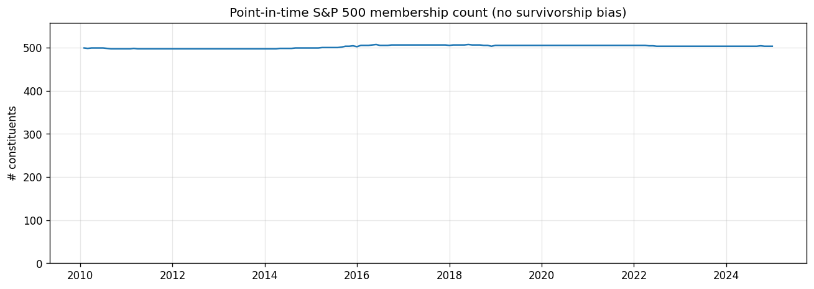
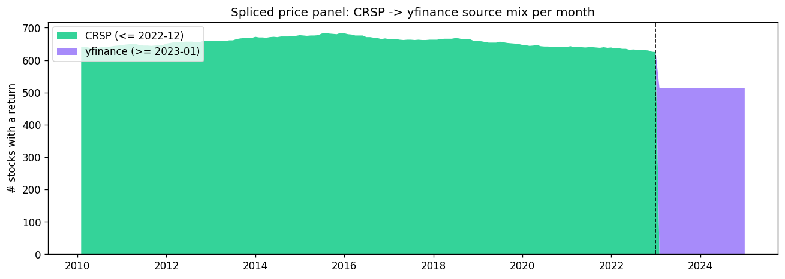
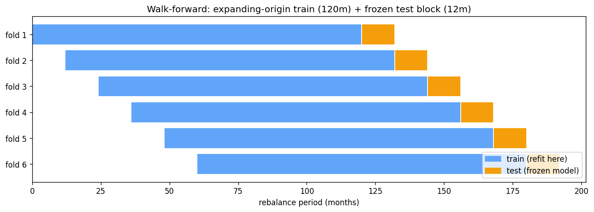
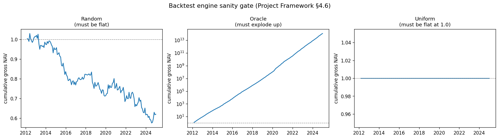

# Data Pipeline and Backtest Engine

*Person A (data + infrastructure). Companion to the Alpha Model section
(Person B) and the Regime Overlay section (Person C). Every design choice
below has a dated entry in `DECISIONS.md`; figures live in
`results/persona_figures/`.*

> **⚠️ PARTIALLY SUPERSEDED (2026-05-24).** The canonical pipeline is now a
> single Sharadar source (SEP `closeadj`, survivorship-free) on the **broad
> ~4,400-name survivorship-free universe** — see **§2 of `REPORT.md`** for the
> current pipeline. Two sections below are **historical**: **§2** (the strict
> S&P-500 / fja05680 universe — now the strict-PIT *comparison baseline* in the
> audit, not the canonical) and **§3** (the CRSP → yfinance splice —
> `load_prices_spliced`, retained as an alternative price source). §§4–10
> (fundamentals, dollar volume, macro, engine, sector control, sanity gate,
> reproducibility) are still current.

---

## 1. Data sources

The strategy is built from six sources, each chosen for point-in-time
correctness over convenience (see DECISIONS 2026-05-13 "Switch primary price
source").

| Source | What | Coverage | Used for |
|---|---|---|---|
| **CRSP MSF** | Monthly stock prices, total returns, shares outstanding | 1925–2022 | Returns, market cap (size) |
| **yfinance** | Daily OHLCV | 2023–2025 (splice tail) + daily volume full-window | Recent returns, dollar volume |
| **Sharadar SF1** | Quarterly fundamentals (equity, net income, assets, debt, cash flow) | 2001–2025 | B/M, E/P, ROE, ROA, D/E, asset growth, accruals |
| **FRED** | VIX, Treasury yields, corporate-bond yields, fed funds | 1990– | Regime features (Person C) |
| **fja05680/sp500** | Point-in-time S&P 500 membership | 1996– | Investable universe |
| *(derived)* | Trailing-21-day average dollar volume | 2003–2025 | Liquidity feature |

All raw files and parquet caches under `data/` are gitignored; the code that
produces them is the source of truth (DECISIONS 2026-04-23). A single command,
`python -m notebooks.persona.run_all_data`, rebuilds every cache.

---

## 2. Investable universe — no survivorship bias  *(HISTORICAL — strict-S&P baseline)*

> *This describes the strict S&P-500 (fja05680) universe — now the **strict-PIT
> comparison baseline** in the audit (on which the factor-adjusted alpha is
> insignificant), NOT the canonical. The canonical trades the broad
> survivorship-free Sharadar union (~4,400 names/month); see REPORT §2.*

The universe is the S&P 500 **as it was on each rebalance date**, not today's
roster. `load_sp500_membership(asof)` reads the fja05680 membership table
(per-ticker join/leave spells) and returns the constituents in force on that
date. A 2008 backtest sees Lehman, Bear Stearns, Wachovia; a 2024 backtest
does not — exactly as a contemporaneous investor would have.

The count holds at ~500 across 2003–2025, with the expected index-reconstitution
churn. Backtests apply this filter at every rebalance, so a stock that left the
index stops being tradable on the correct date (DECISIONS 2026-05-13
"Point-in-time S&P 500 membership source").

---

## 3. Prices: the CRSP → yfinance splice  *(HISTORICAL — superseded)*

> *This section describes the original price path. The canonical strategy now
> sources prices from **Sharadar SEP `closeadj`** (single source, 2002–2024,
> delisted names included), removing the need for a splice; see REPORT §2. The
> splice below is retained in `data_loader.load_prices_spliced` as an
> alternative source and for the yfinance-tail validation that motivated the
> move to Sharadar.*

**CRSP MSF (≤ 2022-12-30)** is the backbone: vendor-grade monthly total returns
keyed by **PERMNO** (a permanent identifier, stable across ticker changes).
Cleaning handles the CRSP conventions that would otherwise corrupt downstream
code: negative `PRC` (bid-ask midpoint) → `abs()`; alphabetic `RET` codes
("B"/"C") → NaN; `SHROUT` (thousands) → market cap.

The school has no ongoing CRSP licence, so **yfinance fills 2023–2025**
(DECISIONS 2026-05-18). The two are spliced into one panel by
`load_prices_spliced`:

- **Identifier reconciliation.** yfinance has no PERMNO, so each CRSP PERMNO is
  mapped to its most-recent in-window ticker. A rename like FB → META is
  collapsed onto "META", so the company's history is contiguous across the
  splice rather than splitting into two columns.
- **Date alignment.** yfinance is snapped to the last *trading* day of each
  month (2022-12-30, not the calendar 2022-12-31) to match CRSP exactly.
- **Return continuity.** yfinance is fetched one month before the splice so the
  first post-splice month's return is computed from a real prior price, not NaN.

**Validation (the gate before trusting the splice):** on a 200-stock overlap
sample (2018–2022, where both sources exist), median monthly-return correlation
between CRSP and yfinance is **0.999999**, 97% of names exceed 0.99, and our
B/M / E/P match the vendor's own ratios to 5–6 decimals. The splice introduces
no regime break at the 2022/2023 boundary.

**Known limit:** ~10–16% of historical tickers (delisted or renamed before
~2022, e.g. SIVB, ATVI, ANTM→ELV) are unavailable under their old symbol in
yfinance. Their history ends cleanly at the CRSP cutoff; the engine's NaN
handling skips them. This is the unavoidable cost of yfinance's free tier.

---

## 4. Fundamentals (Sharadar SF1)

CRSP carries no fundamentals, so the Fama-French value factors come from
Sharadar SF1 via Nasdaq Data Link (DECISIONS 2026-05-22). The point-in-time
discipline is strict: the join key is **`datekey`** (the date a filing became
public), never **`calendardate`** (the fiscal period end) — filings post 30–90
days late, so joining on `calendardate` would leak the future.

The one rule that matters for correctness:

| Factor | Dimension | Why |
|---|---|---|
| **B/M** | `ARQ` (as-reported quarterly) | Book equity is a balance-sheet snapshot |
| **E/P** | `ART` (as-reported TTM) | Single-quarter `netinc` makes E/P ~4× too small / 4× noisier |

This was caught by validation, not assumption: E/P from `ARQ` came out at ~¼ of
the vendor's `1/pe`; E/P from `ART` matches it to six decimals. The extended
factor set (ROE, ROA, D/E, asset growth, accruals) draws the balance-sheet and
cash-flow fields from the same loader.

---

## 5. Dollar volume (liquidity, Feature 4)

The provided CRSP extract has no volume column and the Sharadar subscription's
daily-price (SEP) table is sample-only (ends 2018), so trading liquidity is
sourced from **yfinance daily `close × volume`**, trailing-21-day mean, sampled
at month-ends (DECISIONS 2026-05-22). `close × volume` is split-invariant, so
auto-adjusted inputs give the correct dollar amount. Magnitudes validate against
reality (AAPL ≈ $10 B/day, NVDA ≈ $18 B/day in 2023). We rank on
`log_dollar_volume` since the raw quantity is heavily right-skewed.

---

## 6. Macro features (FRED)

Six FRED series feed Person C's regime model (DECISIONS 2026-05-13): `VIXCLS`,
`DGS10`, `DGS2` (term spread), `DBAA`, `DAAA` (credit spread), `DFF`. Pulled
business-day, forward-filled, cached as a union so any subset is served from
disk.

---

## 7. Backtest engine — walk-forward (`run_walk_forward_backtest`)

The engine is the single integration seam between the three workstreams
(DECISIONS 2026-05-11): it takes a duck-typed model (`fit`/`predict`), an
optional regime function, and an optional sector map, and returns a frozen
`BacktestResult`. The interface is versioned (`INTERFACE_VERSION = 0.3.0`).

Time is partitioned into contiguous **test blocks** of length `test_window`,
each preceded by an expanding-origin sliding **train window** of length
`train_window`. The model is **refit only at each block boundary**
(`(i − train_window) % test_window == 0`) and reused, frozen, across the block.

> A prior version refit at *every* rebalance, contradicting the documented
> design and slowing tuning by up to `test_window`×. Fixing this (DECISIONS
> 2026-05-22 "engine v0.3.0") both sped up sweeps and changed results — the
> headline Sharpe was re-validated on the corrected engine.

**Transaction costs** are charged on L1 turnover (`Σ|wₜ − wₜ₋₁|`) at 10 bps per
side, deducted in the same period the trade is realised — so reported Sharpes
are net.

---

## 8. Portfolio construction — three layers of sector control

| Layer | What | Owner |
|---|---|---|
| **1** | Sector-relative feature ranks (within-sector percentile) | Person B (`factors.py`) |
| **2** | Sector-relative target | Person B |
| **3** | **Sector-neutral construction** (this engine) | Person A (`backtest.py`) |

Layer 3 activates when the regime returns a `k_per_sector` value **and** a
`sector_map` is supplied: instead of a global top/bottom decile, the book takes
the top-*k* / bottom-*k* names by score *within each sector*, removing sector
tilts from the long-short book. (Without a sector map, the engine warns once and
falls back to global deciles.) A `k_per_sector` sweep located the optimum at
**k = 5**.

The **regime overlay** is a `RegimeFn: Timestamp → RegimeParams`, where
`RegimeParams` may set `leverage`, `long_quantile`, `short_quantile`, and
`k_per_sector`. Person C's GMM/HMM overlay is delivered as a CSV that
`regime.make_regime_fn` turns into this function; months outside its range
return neutral defaults. This is what lets the regime scale gross leverage
(calm 1.0× / crisis 0.4×) and tighten sector caps in crises without the engine
knowing anything about how regimes are detected.

---

## 9. Sanity gate (Project Framework §4.6)

No backtest number is trusted until the engine clears three deliberately-rigged
models, run with zero transaction cost to isolate the engine logic:

| Model | Expectation | Proves |
|---|---|---|
| **Random** | \|Sharpe\| ≈ 0 | No look-ahead — uninformative predictions can't make money |
| **Oracle** (sees next-period return) | Sharpe ≫ 5 | The engine actually trades on the prediction sign / dates align |
| **Uniform** (constant score) | return ≈ 0 | No tie-breaking bug — identical scores yield an empty book, not a 100% short |

All three pass on both synthetic and real spliced panels (random bounded, oracle
explodes to 10¹⁴ on a log axis, uniform dead-flat at 1.0). This gate is re-run
after any engine change and gates every model result Person B reports.

---

## 10. Reproducibility

`python -m notebooks.persona.run_all_data` rebuilds every cache in dependency
order from a clean clone, skipping (not failing) when a prerequisite is absent:
the CRSP raw CSV (vendor file, not downloadable) and the Nasdaq Data Link key
(`.env`). Everything else pulls from free public sources. All seeds are pinned to
42. The methodology figures above regenerate with
`python -m notebooks.persona.report_figures`.
