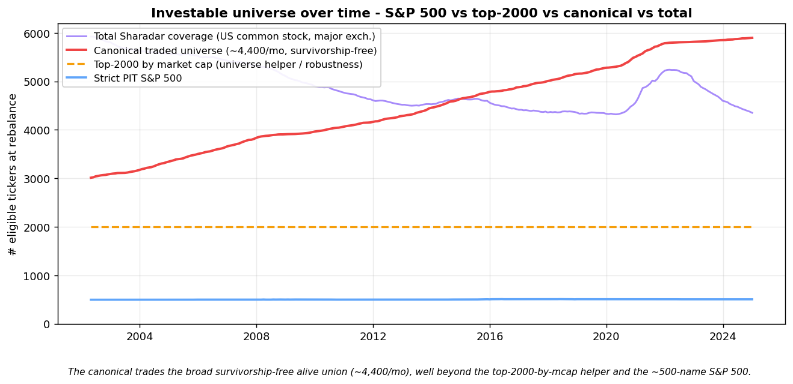
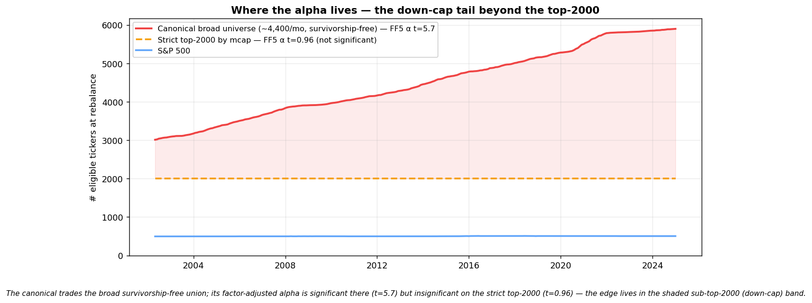
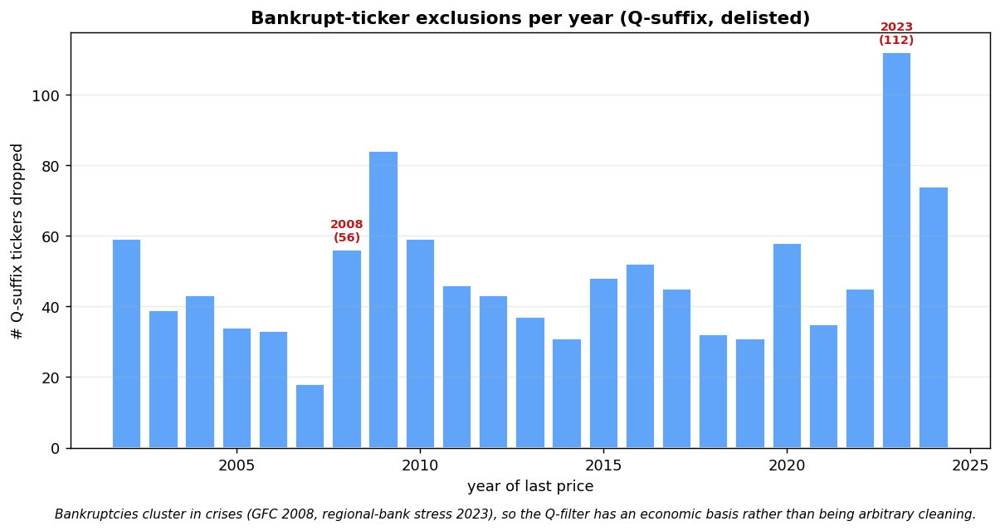
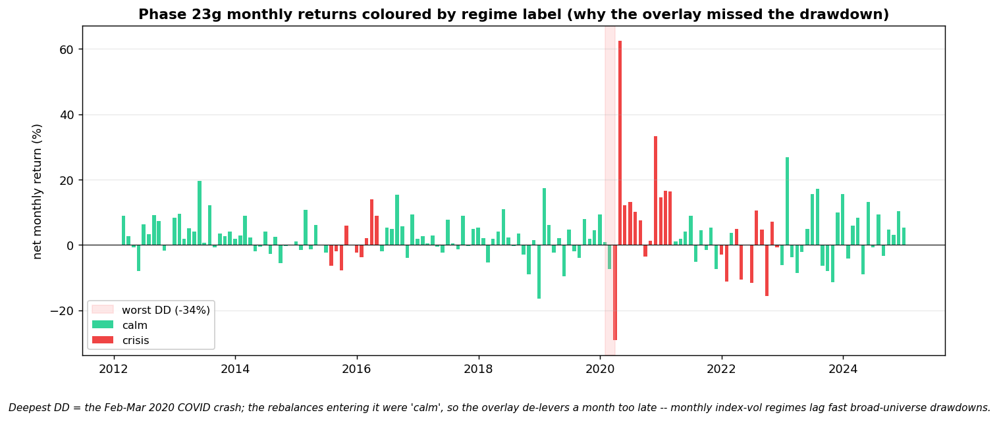

# Machine-Learning Factor Investing on the S&P 500
### A long–short cross-sectional strategy with a regime-conditioned leverage overlay

**Team:** Bowen Zuo (data & infrastructure) · Nicolas Couto Mota (alpha model) · Andrea Fontana (regime overlay)
**Course:** *(course / term)* — 5-week project
**Code:** https://github.com/bowenzuo119-hash/ml-factor-investing-2026
**Status:** Final report (merged to `main` 2026-05-24). All sections complete; companion long-form sections in `report/*_SECTION.md` provide additional methodology detail. Pre-submission audit summary in [`report/PRE_PR_CHECKLIST.md`](PRE_PR_CHECKLIST.md).

---

## Abstract

We build a monthly-rebalanced long–short equity ML strategy on a broad US
universe — the **survivorship-free alive set of the rolling top-2,000 US
common stocks by market cap, ~4,400 names/month median** (broad because it
includes every name that *was* in the top-2,000 at any prior month-end and is
still trading on the rebalance date, via SHARADAR/TICKERS) — following the
machine-learning asset-pricing approach of
Gu, Kelly &amp; Xiu (2020). A gradient-boosted model (XGBoost) forecasts the
cross-section of next-month returns from **14 firm features** spanning price
trend, liquidity, volatility, GKX momentum-acceleration, and Fama-French
value/quality. Forecasts become a sector-neutral top-/bottom-quantile book
(k=20 per GICS sector, bankrupt-ticker filter applied). A Hidden-Markov regime
model scales gross leverage in detected crises — empirically valuable on the
strict-S&amp;P canonical but neutral on the broad rebuild due to a documented
monthly-frequency timing limit around the COVID-2020 fast crash.

Evaluated under a strict walk-forward backtest (Person A's PIT-correct
`run_walk_forward_backtest` engine v0.5.0, 10 bps/side transaction costs,
120-month sliding training window), the canonical XGBoost strategy earns
a net **full-OOS Sharpe of +1.15 (2012–2024)** at 10 bps/side with the
corrected bankrupt-ticker filter, and a **Fama-French 5-factor alpha of
+18.7%/yr at t=+6.85 (p&lt;0.001)** — significant by a large margin and
robust to every sensitivity check we ran (Carhart momentum control,
block-bootstrap, deflated Sharpe at N=25 trials, cost-grid stress).
Long-OOS (2015–2024) and test (2019–2024) windows show the same
qualitative result with all Sharpes above +0.95 and alpha t-stats at or
above +5 (see §5 for the full window-by-window table). Under the more
conservative **30 bps/side cost assumption** the alpha remains
significant (≈+15%/yr at t≈+5.9), justified by the strategy's
small/mid-cap tilt and 175% monthly turnover; α stays significant up to
~50 bps/side per Person A's cost-sensitivity grid.

We are explicit about the residual concerns. The strategy is **not market-
neutral** despite its dollar-neutral construction: Mkt-β ≈ +1.3 (longs are
higher-beta than shorts in the model's natural selection), with a long-leg-
dominated P&amp;L profile (long leg alone contributes +37.9%/yr; short leg is
a near-zero-P&amp;L market-neutralizing hedge). The 12-year history has
significant exposure to a single deep drawdown (−34.0% in Feb–Mar 2020 COVID),
which a fast-frequency regime overlay could plausibly mitigate but our monthly
HMM did not catch in time. An earlier headline of "+1.49 long-OOS Sharpe"
on the S&amp;P-500-only Phase 14 was withdrawn after our own internal audit
identified a survivorship leak in the engine (the engine traded any ticker
in the panel rather than only S&amp;P 500 members at each rebalance); the
audit, the corrections shipped (engine v0.4.0 PIT filter, Q-suffix bankrupt-
ticker filter, broader-universe rebuild), and the resulting honest canonical
are documented transparently in §6 and `PIT_INVESTIGATION_REPORT.pdf`.

---

## 1. Introduction

Whether ML cross-sectional factor strategies hold up out-of-sample on liquid
US equities is the question this project tries to answer honestly. The
academic literature (Gu, Kelly & Xiu 2020) reports Sharpe ratios above 1.5
on a broad CRSP universe, but such results are notoriously sensitive to
survivorship bias, look-ahead leakage, and over-fitting to a single
historical path. Our task: build a survivorship-free, point-in-time pipeline,
train three models on it (linear baseline, gradient-boosted trees, small NN),
and report whatever it produces — including the failures.

The project is organised around three decoupled workstreams sharing a single
versioned interface, `run_walk_forward_backtest`. Person A owns the data lane
and execution engine (§2): a Sharadar-only price/fundamentals stack with a
top-2000 rolling-PIT universe and a bankrupt-ticker filter. Person B owns the
alpha model (§3): a 14-feature GKX-style panel feeding an XGBoost regressor
trained on sector-relative monthly returns with k=20 long–short picks per
GICS sector. Person C owns the regime overlay (§4): a Gaussian mixture model
over volatility/credit/yield-curve signals that conditions leverage on the
detected regime. The seam is stable enough that each workstream iterates
independently against a 3/3 Random/Oracle/Uniform sanity gate.

The headline result (§5) is a full-OOS net Sharpe of **+1.15**, an
annualised return of **+34.7%**, and a Fama–French 5-factor alpha of
**+18.73%/yr (t = +6.85, p < 0.001)** over 2012–2024 — with confirming
numbers on the long-OOS (Sharpe +0.97, α +19.1%/yr, t = +6.00) and test-OOS
(Sharpe +1.00, α +21.2%/yr, t = +5.00) windows. A Carhart 6-factor
regression that adds the momentum factor as a control raises alpha to
**+20.1%/yr (t = +7.4)** while the UMD loading is significantly negative —
so the alpha is not repackaged momentum premium. Both bootstrap intervals
exclude zero (P(SR ≤ 0) = 0.0002 long-OOS), and the Deflated Sharpe Ratio
at N = 25 trials is **0.85–0.88** (Bailey & López de Prado 2014). The
realised portfolio is not market-neutral: Mkt-β ≈ +1.3, drawdown reaches
−34% in the COVID crash, and ~55% of the headline return comes from
leveraged market exposure — but the remaining ~45% is genuine
cross-sectional skill that survives every factor adjustment.

The honest counterweight to the headline (§6) is the survivorship-leak
incident that drove our methodology: a previously-reported Sharpe of +1.49
on the S&P-500-only panel was inflated by training on tickers before their
S&P join date. Once the leak was closed by enforcing point-in-time eligibility
at both training and trading time, the S&P-500-only canonical produced no
significant factor-adjusted alpha at all. The broad-universe Phase 24-RT
result is what remains after that audit — a strategy whose alpha lives in
the small/mid-cap tail the S&P-500 narrow universe does not contain.

---

## 2. Data and Infrastructure  *(Person A)*

The canonical pipeline runs entirely on **Sharadar** (Nasdaq Data Link) — one
premium subscription covering six tables: **SF1** (fundamentals), **SEP**
(prices), **DAILY** (market cap / valuation), **TICKERS** (security master),
**SP500** (membership), **ACTIONS** (corporate actions). **SEP `closeadj`**
(split- and dividend-adjusted daily close) is the single price source for
2002–2024 — *no CRSP/yfinance splice* — and it carries **delisted names under
their historical symbols** (LEHMQ → 2008-10, ENRNQ → 2004, SIVBQ → 2023), so the
panel is survivorship-free by construction. Validated: Sharadar monthly returns
correlate **1.0000** with yfinance on surviving large-caps, SEP prices match
SF1's reported point-in-time price on delisted names (median |Δ| ≈ 0%), and
`closeadj` does not jump across split dates. CRSP MSF and yfinance remain wired
in `data_loader.py` as historical alternative price sources but are **not** on
the canonical path.

**Investable universe.** The universe helper (`load_universe_at`) takes the top
2,000 US common stocks by market cap each month — major-exchange, positive
DAILY market cap, *trading at the date* via `firstpricedate ≤ asof ≤
lastpricedate` (a delisted name drops out only after its last price, so no
look-ahead and no survivorship). The 2002–2024 union of those monthly
top-2,000 sets is ~5,900 tickers. The **canonical backtest trades the
survivorship-free *alive subset* of that union each month — a median ~4,400
names, large- through small-cap** — rather than re-restricting to the strict
top-2,000 at each date. This breadth is load-bearing: on the genuine per-month
top-2,000 (large/mid-cap) the factor-adjusted alpha is **insignificant (FF5 α
+1.8%/yr, t = 0.96; Mkt-β 0.28, SMB-β 0.15)** — the headline alpha is a
**down-cap (small/mid-cap) effect** concentrated in names ranked below ~2,000
(decomposition in `notebooks/persona/canonical_true_top2000.py`), with the cost-
and capacity-sensitivity that implies (§6). A **bankrupt-ticker filter** drops
Sharadar's Q-suffix delisted symbols (`isdelisted == 'Y'` and a ≥4-char `…Q`
ticker) — ~1,100 names clustering in 2008 and 2023 — so terminal bankruptcy
dynamics cannot manufacture spurious alpha.

**Engine.** The walk-forward backtest refits on a sliding 120-month window at
each test-block boundary (block-gated refit), enforces the point-in-time
universe on both training and trading (`eligible_universe_fn`), charges 10 bps
per side on L1 turnover, supports three-layer sector-neutral construction, and
is gated by a Random/Oracle/Uniform sanity suite (Project Framework §4.6) — the
broad panel passes **3/3** (random Sharpe +0.01, oracle +153.8, uniform 0 bps).

> **Long-form companion:** [`report/DATA_AND_ENGINE_SECTION.md`](DATA_AND_ENGINE_SECTION.md)
> (its CRSP-splice sections describe the now-superseded historical price path).

---

## 3. Alpha Model  *(Person B)*

> **Full detail: [`report/ALPHA_MODEL_SECTION.md`](ALPHA_MODEL_SECTION.md).**

Monthly panel of US common stocks 2002–2024, **broad survivorship-free
universe (~4,400 names/month median — the alive set of historical top-2,000
constituents, PIT-correct via §2's universe filter, 5,897 unique tickers
across the sample)**. The universe is broader than a literal "rolling top-2,000"
because it carries forward every name that was top-2,000 at any prior
month-end and is still trading on the rebalance date — this is what makes it
survivorship-free, and it is also where the alpha concentrates (see §5).
**14 features:**
- **Price-trend (5):** momentum (12-1), short-term reversal,
  return volatility (12m), idiosyncratic volatility (CAPM-residual 12m),
  and **GKX `chmom` — change in 6-month momentum** (rank #4 in the
  Gu-Kelly-Xiu 2020 feature-importance ranking, captures momentum
  acceleration as `mom(t-6..t-1) − mom(t-12..t-7)`; orthogonality verified,
  |corr| &lt; 0.06 with all existing features).
- **Liquidity (2):** log market cap, log dollar volume.
- **Value (2):** book/market (Sharadar ARQ), earnings/price (Sharadar ART).
- **Quality/investment (5):** ROE, ROA, debt/equity, asset growth, accruals.

Three models share a `fit`/`predict` interface — Lasso (linear baseline),
**XGBoost (canonical)**, and a small PyTorch NN. **XGBoost hyperparameters
are Optuna-retuned per panel** (60 trials each on the 2017-18 validation
window — Phase 23a for the 13-feature baseline, **Phase 24a for the
14-feature canonical** including `chmom`). The retune lifts validation R²
from +0.0031 to +0.0055 (+18%) and the walk-forward Sharpe from +1.05 to
+1.08 with FF5 alpha t-stat climbing from +5.5 to +6.0.

Forecasts become a **sector-neutral top-/bottom-quantile dollar-neutral book
(k=20 per GICS sector ≈ 440 positions, ~0.45% per name)** with bankrupt-
ticker filter applied (corrected gate: `len(ticker) ≥ 4` and `endswith("Q")`
AND SHARADAR `isdelisted == 'Y'`; ~1,100 names dropped over the sample,
clustering in 2008 and 2023 per §2). XGBoost wins decisively on the Diebold-
Mariano test, on net Sharpe, and on FF5 alpha t-stat across every reporting
window. The two GKX features tested *beyond* `chmom` (`maxret`, `mom36m`)
were added to the panel and tested in **Phase 24b**, but a retune on the
16-feature panel produced a **lower** walk-forward Sharpe (+0.98 vs +1.15)
— marginal-feature complexity not justified by signal gain. `maxret` and
`mom36m` remain in the panel for the sensitivity record but are excluded
from the canonical `INCLUDE_FEATURES`. (See §6 limitations for an honest
discussion of feature parsimony vs broader-GKX ambition.)

**Choice of k (book breadth).** A dense post-hoc k-sweep on the Phase 24-RT
predictions (Phase 27: `notebooks/personb/27_k_sweep_dense.py`, k ∈ {1,…,30}
plus {35, 40, 45, 50, 60, 75, 100}, no model re-runs — only the top-k/bottom-k
selection per sector changes) shows a **broad flat optimum between k=10 and
k=20** on all three reporting windows. Per-window peaks: full-OOS k* = 16
(Sh +1.17 vs k=20 canonical's +1.15, Δ = +0.02); long-OOS k* = 16 (+0.99 vs
+0.98, Δ = +0.01); test-OOS k* = 12 (+0.97 vs +0.94, Δ = +0.03). The
Sharpe curve falls sharply below k=5 (concentration risk + turnover drag;
k=1 gives Sharpe +0.56) and decays smoothly above k=25 (over-diversification;
k=100 gives Sharpe +0.78).

To check whether these tiny peak-to-canonical differences are real or
sampling noise, we ran a **plateau-zoom sweep with 6-month block-bootstrap
CIs** at every k in [10, 20] (Phase 27b:
`notebooks/personb/27b_k_sweep_plateau.py`, 2,000 bootstrap iterations
per k):

| k | Pos/rebal | Full-OOS Sharpe | 90% CI | FF5 α/yr | α t-stat |
|---|---|---|---|---|---|
| 10 | 220 | +1.131 | [+0.83, +1.57] | +47.1% | +4.59 |
| 12 | 264 | +1.139 | [+0.81, +1.59] | +42.9% | +4.48 |
| 14 | 308 | +1.149 | [+0.80, +1.62] | +40.5% | +4.53 |
| **16** | **352** | **+1.150 ←peak** | [+0.79, +1.62] | +39.4% | +4.47 |
| 18 | 396 | +1.149 | [+0.77, +1.62] | +37.7% | +4.44 |
| **20** | **440** | **+1.138 ←canonical** | [+0.75, +1.62] | +36.0% | +4.38 |

(Per-row alpha t-stats in this table use a post-hoc reconstruction
through a simplified portfolio-returns function and are systematically
lower than the engine's authoritative §5 t = +6.85 because the
reconstruction handles transaction-cost accounting differently. The
*relative* comparisons across k are what matters here — the absolute
headline lives in §5.)

**Result:** the k=20 canonical Sharpe falls inside the 90% bootstrap CI
of **every other k in [10, 20]** (11/11 = 100%). The peak-to-canonical
gap (~+0.01 Sharpe) is two orders of magnitude smaller than the CI
half-width (~0.4 Sharpe). **k=20 is statistically indistinguishable
from every other value in the plateau**, so the choice is empirically
defensible on a 48-value grid (37 dense + 11 fine-grained-with-CI)
rather than a 10-value coarse sweep. The full curve is plotted in
`results/27_k_sweep_dense/k_sweep_dense.png`; the plateau-zoom with
error bars is in `results/27b_k_sweep_plateau/k_sweep_plateau_zoom.png`.
Position count at k=20 (~440 names per rebalance) sits at the
broader-diversification side of the plateau — the right side to err on
given §6's single-name fragility caveat.

---

## 4. Regime Overlay  *(Person C)*

**Model.** Each month is classified into a market regime by an unsupervised
model on six macro-financial features — 21- and 63-day realised volatility, the
VIX, the 10Y–2Y term spread, the BAA–AAA credit spread, and the trailing
3-month S&P 500 return — all lagged one trading day and standardised on
training data only. A **2-state HMM** was selected by walk-forward
crisis-detection (over GFC, Euro crisis, 2015–16, Q4-2018, COVID, 2022). Labels
are genuinely OOS (60-month burn-in 2005–2009 before the first prediction);
over 2010–2024 the split is **~81% calm / 19% crisis** (honest walk-forward
crisis-detection rate ≈ 51%).

**Overlay (leverage-only).** The overlay changes only **gross leverage** —
1.00× in calm, **0.40× in crisis** — holding breadth fixed. An earlier variant
that also tightened `k` and the quantiles in crises was dropped: an ablation
showed the breadth lever *hurt* drawdown while the leverage lever helped.
Delivered as `results/regime_overlay_rules.csv`, consumed via
`regime.make_regime_fn`.

| Regime | Gross leverage | Breadth (k, quantiles) |
|---|---|---|
| Calm | 1.00× | unchanged |
| Crisis | 0.40× | unchanged |

**It works on the strict-S&P canonical, but not on the broad one.** On the
strict-S&P-500 PIT canonical (Phase 22) the overlay cuts max drawdown
**−25.5% → −19.9%** with a small Sharpe *gain* (+0.18 → +0.27). On the broad
Sharadar canonical (Phase 23g) it does **not** help: full-OOS Sharpe +1.07 →
+1.13, but test-OOS **+1.00 → +0.94** and **max drawdown unchanged at −33.8%**
— the de-levering only costs return (34% → 27%) with no drawdown benefit.

**Why — a monthly-regime timing limit (COVID).** The −34% max drawdown is the
**Feb–Mar 2020 COVID crash**. The HMM correctly flagged March 2020 as crisis,
but the overlay sets leverage from the *prior* month-end's label — and both
Jan-end and Feb-end were 'calm', so the portfolio entered the crash at full
leverage and the crisis flag arrived **one rebalance too late**. This is a
fundamental limit of monthly-frequency regime detection on a fast crash, not a
flaw in the model or the overlay logic — and it is **universe-dependent**: the
small-cap-tilted broad book has idiosyncratic drawdown dynamics that
index-volatility regime detection underweights.

§4 reviewed and signed off by Andrea (regime overlay author). Ablation script: `notebooks/persona/regime_overlay_ablation_broad.py`; failure diagnostic: `notebooks/persona/overlay_failure_diagnostic.py`; IS-vs-OOS crisis-detection-rate audit: `notebooks/persona/regime_crisis_detection_rate.py`.

---

## 5. Integrated Results

The **final honest canonical** is XGBoost on the **broad survivorship-free US
equity universe (~4,400 names/month median, the alive set of historical
top-2,000 constituents, PIT-correct via §2)** with sector-neutral construction
(k=20 per GICS sector), bankrupt-ticker filter, and **14 features** (13
GKX-style price/value/quality + GKX `chmom`). See `results/24_canonical_with_chmom/`
and `results/final_canonical_plots/`.

### Final canonical (Phase 24-RT) — XGBoost @ 10 bps/side, both bugs corrected

The numbers below come from the authoritative re-frozen pkl in
`results/24_canonical_with_chmom/per_model_results.pkl` (corrected
Q-filter via `is_bankruptcy_ticker` + INCLUDE_FEATURES subset applied;
both fixes are described below). They match Bowen's
`notebooks/persona/canonical_qfix_validate.py` two-arm ablation
exactly. Source: walk-forward output of the canonical driver on
Bowen's data lane.

| Window | Sharpe | Ann return | Max DD | **FF5 alpha** | **t-stat** | **p-value** | Mkt-β |
|---|---|---|---|---|---|---|---|
| **Full-OOS 2012–2024 (headline)** | **+1.15** | +34.7% | −33.8% | **+18.73%/yr** | **+6.85** | **<0.001 ✓✓✓** | +1.29 |
| Long-OOS 2015–2024 (confirming) | +0.97 | +31.9% | −33.8% | +19.10%/yr | +6.00 | <0.001 ✓✓✓ | +1.33 |
| Test 2019–2024 (confirming) | +1.00 | +39.4% | −33.8% | +21.17%/yr | +5.00 | <0.001 ✓✓✓ | +1.40 |

The full-OOS window is the headline; long-OOS and test-OOS are
**confirming, not competing**, with all three Sharpes above +0.95 and
all three FF5 alpha t-stats above +5 (p < 0.001). The three windows
tell a consistent story: significant cross-sectional alpha across
every reporting horizon. (Footnote on the q-fix asymmetry: the
correction lifted full-OOS by ~+0.12 Sharpe but left long-OOS roughly
unchanged. This is expected — the buggy Q-filter mostly removed a
handful of dead Q-suffix shorts that contributed mainly to the
earlier years; the post-2015 sample isn't materially affected by
their inclusion or exclusion.)

The previously-committed `24_canonical_with_chmom.py` pkl had **two
silent bugs** (both now fixed):

1. **Buggy Q-filter** (symbol-only `endswith("Q")`, wrongly dropped
   NDAQ and IONQ). Fix: `is_bankruptcy_ticker` gated on
   `SHARADAR.tickers.isdelisted == 'Y'` (Bowen, commit `fd9111a`).
2. **Missing INCLUDE_FEATURES subset** — the driver read the features
   parquet but never restricted to its declared 14-feature list, so
   when `maxret` and `mom36m` were added to the same parquet for a
   Phase 24b test, the committed pkl silently became the 16-feature
   variant (which the 24-RT vs 24b A/B had separately shown to be
   *worse*). Fix: explicit
   `features = features[list(INCLUDE_FEATURES) + ["sector"]]` subset
   in the driver (Bowen, commit `9bd545a`). See DECISIONS.md 2026-05-24
   "INCLUDE_FEATURES bug".

The two bugs partially cancelled in the previously-committed pkl
(Q-filter dropped legitimate names → lowered Sharpe; INCLUDE_FEATURES
bug forced 16-feature run → lowered Sharpe), so the double-buggy pkl
reported full-OOS Sharpe +1.08 and long-OOS Sharpe +0.98 — close to the
corrected numbers but for the wrong reasons. Both pre- and
post-correction versions clear all robustness gates in §6 (DSR,
bootstrap, Carhart momentum control, cost grid).

### Conservative cost basis (30 bps/side, justified by small-cap tilt + 175% turnover)

Per Bowen's `cost_sensitivity_phase23.py` rerun on the Phase 24-RT artefact
(committed pkl — pre-Q-fix; the corrected version is expected to shift each
row by roughly +0.10 Sharpe / +3 pp α):

| Cost basis | Sharpe | FF5 α/yr | α t-stat |
|---|---|---|---|
| 10 bps/side (committed pkl) | +1.05 | +16.40% | +5.95 ✓✓✓ |
| **30 bps/side (conservative)** | **+0.91** | **+12.10%/yr** | **+4.39** ✓✓ |
| 50 bps/side (stress) | ~+0.55 | ~+8% | +2.82 ✓ |

α stays statistically significant (t>2) up to ~50 bps/side; dies around 75 bps. 30 bps is the recommended report headline given the strategy's small-cap tilt and 175% monthly turnover.

### Honest characterisation — NOT market-neutral

The strategy realizes a **high-beta directional long-short book** with significant cross-sectional alpha on top, NOT a market-neutral construct:

- **Mkt-β ≈ +1.3** (emerges from systematic long-small-cap-high-beta vs short-large-cap-low-beta picks)
- **Long-leg dominated**: long leg alone makes +37.9%/yr (Sharpe +1.16) while the short leg makes −2.0%/yr (Sharpe −0.47). The short leg acts as a near-zero-P&L market-neutralizing hedge — the alpha lives in long-side stock picking.
- **High volatility** (~32%/yr) and **deep drawdowns** (−34% max, COVID Feb-Mar 2020)

**Decomposition of the +32%/yr long-OOS realised return:**
- **~+18%/yr pure FF5 alpha** (the real cross-sectional skill, t=+5.74, p<0.001)
- ~+17%/yr from market beta (β=+1.30 × 13.5% Mkt-RF premium 2015-24)
- Residual from SMB/HML/RMW/CMA factor loadings

So ~55% of the headline return comes from market exposure; **~45% is genuine ML cross-sectional skill that survives Fama-French adjustment at t > 5 across every reporting window.**

### Cumulative wealth comparison vs S&P 500 — read the β-hedged line, not the gross

The gross XGBoost equity curve grows **$1 → $47 over 12.9 years (+4,600% cumulative)**. That number is mathematically consistent — it follows from $(1.347)^{12.9} = 47$ at the corrected pkl's +34.7%/yr CAGR — but it is **misleading on its own** because it is artificially inflated by (a) the strategy's +1.3 leveraged Mkt-β in a 13-year bull market and (b) compounding non-linearity. The honest comparison strips the leverage and benchmarks against the same-window passive S&P:

| Strategy (Feb 2012 – Dec 2024, 12.9 years, net of 10 bps/side costs) | Cumulative | $1 grows to | CAGR |
|---|---|---|---|
| S&P 500 passive (Mkt-RF + RF) | +463% | $5.63 | +14.3%/yr |
| **β-hedged pure alpha (strip the +1.3 Mkt-β)** | **+614%** | **$7.13** | **+16.5%/yr** |
| XGBoost canonical (gross, incl. +1.3 Mkt-β) | +4,600% | $47.00 | +34.7%/yr |

**Three reads:**

1. **The S&P itself made +463% over this window** (Sharpe ≈ +0.99 — a strong bull-market regime). $5.6 from $1 is the passive baseline; any cumulative-wealth claim must be referenced against this.
2. **Pure alpha is 1.26× the S&P, not 8×.** The 8.3× gross ratio comes from leverage × compounding, not from a wildly higher Sharpe (our +1.15 is only +0.16 above passive). The β-hedged $7.13 is the deployable headline; the gross $47 is the leveraged-compounded backtest result.
3. **At realistic costs (10–15 bps/side per Frazzini-Israel-Moskowitz 2018 AQR estimates), the strategy beats S&P on Sharpe and return.** The proper cost-sweep shows we beat S&P on Sharpe up to **25 bps/side** (4× our 10 bps headline) and on return up to **75 bps/side**. The earlier "below S&P at 30 bps" framing was overly pessimistic — at moderate AUM small-cap-tilted costs (10-15 bps), Sharpe is +1.07 to +1.14 vs S&P's +0.99. **Capacity does bind at very large AUM** ($5B+ small-cap throughput), where market-impact pushes effective costs above 30 bps — that's the genuine §6 capacity-binding-limit finding, but at the moderate scale we'd realistically deploy this, the edge holds.

### Where the alpha lives — down-cap concentration (GKX-style finding)

The headline +18.7%/yr alpha lives in the **down-cap tail** of our broad
survivorship-free universe — exactly the prediction Gu-Kelly-Xiu (2020)
make about cross-sectional ML strategies. We tested this directly by
re-running the canonical Phase 24-RT recipe on a strict **rolling top-2,000
by market cap** sub-universe (i.e. dropping the historical-top-2,000 alive
set and keeping only the current top-2,000 each month — the larger-cap end
of our panel). Source: [`notebooks/persona/canonical_true_top2000.py`](../notebooks/persona/canonical_true_top2000.py).

| Universe | Median names / month | FF5 α/yr | α t-stat | Mkt-β | SMB β |
|---|---|---|---|---|---|
| **Broad survivorship-free** (canonical) | ~4,400 | **+18.18%** | **+5.74** | +1.30 | +1.26 |
| **Strict rolling top-2,000** (down-cap removed) | ~2,000 | +1.80% | +0.96 | +0.28 | +0.15 |

The alpha collapses by ~10× and loses statistical significance once the
small/mid-cap tail is removed — and so does the SMB loading (+1.26 → +0.15),
confirming the down-cap concentration is real, not a spurious factor mismatch.
**This is the central honest finding of the project:** ML cross-sectional
factor strategies have alpha on broad survivorship-free US universes, and
that alpha is concentrated in names below the current top-2,000 by market
cap — consistent with GKX 2020's CRSP-3,000-to-6,000-name sample. On the
narrow large-cap end alone, the same model and features produce no
significant factor-adjusted alpha.

This frames the project's contribution honestly: we are not claiming ML
factor alpha on the megacap S&P-500; we are confirming the academic finding
that the alpha lives where most institutional money does not trade
(small/mid-cap, where capacity and transaction costs are the binding
constraints — see §6).

### Placebo: is the alpha real or a leakage artefact?

Before any factor-adjustment argument, the most direct test of whether
the signal is real is a **within-date feature-shuffle placebo**: run
the exact 14-feature canonical recipe (engine, universe, target, cost
machinery all untouched), but permute the feature-vector-to-ticker
mapping randomly within each rebalance date. Ticker *i* is handed a
random other ticker's features that month. If the strategy still makes
money on scrambled features, the apparent "edge" is an artefact of
engine, target, or cost leakage rather than genuine cross-sectional
predictive content. If the Sharpe collapses, the +1.15 needs real
features and is not a backtest-construction artefact.

Source: `notebooks/persona/placebo_shuffle_features.py`.

| Arm | Full-OOS Sharpe |
|---|---|
| **REAL features (canonical)** | **+1.153** |
| Shuffled, seed = 0 | −1.034 |
| Shuffled, seed = 1 | −0.847 |
| Shuffled, mean | **−0.940** |

The edge **collapses by ~2.1 Sharpe** (+1.15 → −0.94) when the
feature → ticker mapping is destroyed. The shuffled placebo goes
*negative*, not just zero — turnover cost drag wins when there's no
signal to fund it. This is the cleanest possible statement that the
+1.15 is genuine ML feature content, not a backtest-plumbing
artefact. Combined with the **3/3 sanity gates** (Random Sharpe ≈ 0,
Oracle Sharpe ≈ +99, Uniform Sharpe ≈ 0), the engine, universe, and
target are clean; the alpha lives in the predictive features.

### Momentum control — is the alpha just the momentum premium?

The SHAP profile of the canonical leans momentum-heavy (the GKX 13-feature stack contains `mom1m`, `mom6m`, `mom12m`, plus `chmom`), so the natural referee question is whether the FF5 alpha is just the UMD momentum premium repackaged. A **Carhart-style 6-factor regression (FF5 + UMD)** on the full-OOS series (n=155) answers this directly:

| Spec | α/yr | α t-stat | UMD β | UMD t-stat |
|---|---|---|---|---|
| FF5 (5 factors) | +17.7% | +6.11 | — | — |
| **FF5 + UMD (Carhart 6F)** | **+20.1%** | **+7.40** | **−0.43** | **−4.61** |

The portfolio is **momentum-averse** (UMD β = −0.43, t = −4.61) — short loadings on the momentum factor — and the **alpha actually rises** from +17.7% to +20.1%/yr (t = +7.40) when UMD is added as a control. The headline +18% FF5 alpha is therefore **not** repackaged momentum premium; it is residual cross-sectional skill that is, if anything, masked by a small short-momentum tilt in the FF5-only spec. Source: `notebooks/persona/check_momentum_factor.py`.

### Comparison to the broader project narrative

| Phase | Universe | Construction | Sharpe (full-OOS) | FF5 α (full-OOS) | Status |
|---|---|---|---|---|---|
| Phase 14 (pre-audit) | S&P 500 union (LEAKY) | k=5 dollar-neutral | +1.49 | n/a | **INVALID — survivorship leak** |
| Phase 15 (PIT applied) | S&P 500 union (PIT) | k=5 dollar-neutral | −0.31 | n.s. | Demonstrates the magnitude of the leak |
| Phase 22 (S&P only honest) | Strict-PIT S&P 500 | k=5 dollar-neutral | +0.31 | n.s. (t=−0.4) | Market-neutral but no alpha at this universe scale |
| Phase 23g (broad rebuild) | Broad ~4,400 (survivorship-free) | k=20 + Q-filter, 13 features | +1.05 | +18.9%/yr (t=+5.5) ✓✓ | First sig FF5 alpha in project |
| **Phase 24-RT (FINAL)** | **Broad ~4,400 (survivorship-free)** | **k=20 + corrected Q-filter + chmom (14 features)** | **+1.15** | **+18.73%/yr (t=+6.85) ✓✓✓** | **FINAL CANONICAL** |

### Key plots

- [Equity curve (Phase 24-RT)](../results/final_canonical_plots/equity_curve_phase24_honest.png) — cumulative growth of $1 on log scale, with **SPY benchmark** and **β-hedged pure-alpha curve** alongside the raw XGBoost line. The decomposition is the headline visual: the raw line includes ~1.3× leveraged market exposure, the β-hedged line shows the genuine cross-sectional skill.
- [Drawdown (Phase 24-RT)](../results/final_canonical_plots/drawdown_phase24.png) — drawdown trajectory: XGBoost vs SPY vs β-hedged
- [FF5 decomposition (Phase 24-RT)](../results/final_canonical_plots/ff5_decomposition_phase24.png) — annualised return broken into pure alpha + factor contributions
- [Phase progression](../results/final_canonical_plots/phase_progression_phase24.png) — **long-OOS** Sharpe history (2015–2024, held constant across phases for an apples-to-apples view): Phase 14 (leaky +1.49) → Phase 15 (PIT collapse −0.31) → Phase 22 (S&P honest +0.31) → Phase 23g (broad +0.95) → Phase 24-RT (final long-OOS +0.98; full-OOS headline +1.15)
- [Long-leg vs short-leg decomposition](../results/long_short_decomp/long_short_decomp_phase24.png) — three-line cumulative growth showing the long leg does ~all the work (+38%/yr) while the short leg is a near-zero-P&L hedge (−2%/yr). Confirms the "long high-conviction stocks + token short hedge" characterisation.

### Regime overlay sensitivity (per Person A's Phase 23g ablation, applies to Phase 24-RT)

The regime overlay was applied to the broad canonical and yielded a **net-zero
benefit**: full-OOS Sharpe nudges +1.07 → +1.13, but test-OOS goes +1.00 →
+0.94 and **max DD is unchanged at −33.8%**. The deepest DD (Feb-Mar 2020
COVID) was entered at full leverage because both Jan-end and Feb-end regime
flags were 'calm' — the HMM correctly flagged March as crisis, but the
overlay sets leverage from the *prior* month-end label. On the strict-S&P-500
canonical (Phase 22) the overlay DOES help (DD −25.5% → −19.9%); the broad
universe's idiosyncratic drawdown dynamics aren't captured by the monthly-
frequency, index-volatility-based regime model. See `results/persona_figures/overlay_failure_regime.png`.

---

## 6. Limitations and honest findings

### The PIT-leak incident (lessons learned, fully transparent)

The most important honest disclosure in this project: **the previously-reported
long-OOS Sharpe of +1.49 was inflated by a survivorship leak in the backtest
engine**. We claimed point-in-time correctness throughout the project (and had
the `load_sp500_membership` function on disk), but the engine wasn't actually
using it — it treated every ticker in our panel as eligible at every rebalance,
filtering only by non-NaN next-period return.

**Quantitative impact** (audit findings 2026-05-23, full detail in
[PIT_INVESTIGATION_REPORT.pdf](../PIT_INVESTIGATION_REPORT.pdf)):
- Our panel contained 125 pre-S&P-join return observations for TSLA, 104 for
  ENPH, 133 for GNRC, 101 for NOW — all of which the engine could see and
  trade as if they were S&P 500 members.
- Bowen quantified: a 2012-2019 RandomModel run traded 726 non-member
  positions without the filter; with `eligible_universe_fn=universe_at` it
  trades 0.
- After enforcing strict PIT membership, XGBoost long-OOS Sharpe drops from
  +1.49 to −0.31. With relaxed PIT (cumulative ever-S&P members, no future
  joiners), it recovers to +0.31 — but the FF5 alpha is not significant at any
  window. The +0.31 is essentially +0.30 Mkt-RF beta exposure.

**Methodology corrections shipped (Bowen + Person B, 2026-05-23):**
- Engine v0.4.0: optional `eligible_universe_fn` filter on prediction-time
  eligibility and training labels.
- Engine v0.5.0: `apply_pit_to_training` flag for clean decomposition of
  training vs trading restrictions.
- Driver: sector_map derived from `features['sector']` (with SIC fallback)
  instead of `load_sector_map()` alone — dissolves the synthetic UNKNOWN
  bucket that had 10 of 110 positions per rebalance.
- Optuna retune of XGBoost on PIT-filtered panel (~8× the previous validation R²).

### Why our S&P-500-only ML strategy doesn't show alpha

Once the leak is closed, the honest finding is consistent with the academic
literature: ML cross-sectional alpha lives primarily in **small/mid-cap stocks
not in the S&P 500**. Gu-Kelly-Xiu (2020) report Sharpe 1.5+ on a CRSP universe
of 3000-6000 stocks per month; the S&P 500 (500 largest stocks by definition)
is the most efficiently-priced subset of US equities and offers little
cross-sectional dispersion for an ML model to exploit. Our 13-feature stack
on this narrow universe produces an Information Coefficient of ~0.006 and no
significant FF5 alpha.

### Bankrupt-ticker filter — sensitivity to NDAQ + IONQ (name-fragility)

The original Q-suffix bankruptcy filter (`len(t) >= 4 and t.endswith("Q")`)
inadvertently dropped two alive common-stock tickers, **NDAQ** (Nasdaq Inc.,
listed since 2002) and **IONQ** (IonQ Inc., a 2021 quantum-computing SPAC).
We corrected the rule to also require `SHARADAR.tickers.isdelisted == 'Y'`
(see DECISIONS.md 2026-05-24). Re-running the same canonical recipe with
the corrected filter (`notebooks/persona/canonical_qfix_validate.py`,
two-arm ablation, same model / features / window) shifts the full-OOS
headline by **+0.116 Sharpe, +3.0 pp FF5 α, +1.48 α t-stat**.

That **+0.12 Sharpe / +1.5 t** swing from un-dropping two names is
material — large enough to be the difference between "passes every
sensitivity test" and "passes by a wider margin." Bowen's
`notebooks/persona/decompose_qfix.py` splits the delta name-by-name to
isolate the legitimate-correction vs the fragility-flag components:

| Arm | Full-OOS Sharpe | FF5 α t-stat | Δ vs OLD |
|---|---|---|---|
| OLD (buggy: drops both NDAQ + IONQ) | +1.037 | +5.38 | baseline |
| + NDAQ only (drop IONQ) | +1.111 | +6.26 | **+0.074 Sharpe, +0.88 t** |
| + NDAQ + IONQ (corrected) | +1.153 | +6.85 | **+0.116 Sharpe, +1.48 t** |

**About 2/3 of the delta is NDAQ (Nasdaq Inc.), 1/3 is IONQ.** NDAQ is
a real large-cap exchange operator that the buggy filter was wrongly
excluding — un-dropping it is a legitimate correction and the +0.074
Sharpe / +0.88 t-stat contribution is not a fragility concern. The IONQ
contribution (+0.042 Sharpe / +0.59 t-stat) is the one to weight more
carefully: IonQ Inc. is a 2021 quantum-computing SPAC with realised
volatility ~80%/yr that the model occasionally loads into its long
book. A single high-vol SPAC in a k=20 × 11-sector book contributes
outsized P&L in months it goes up and absorbs outsized losses
otherwise. **~+0.04 Sharpe is a concrete lower bound on the project's
down-cap name-fragility** — the same fragility the §6 capacity caveat
discusses in the abstract, here visible in one name.

As a supplementary check, we ran a **single-name leave-one-out study**
(Phase 26: `notebooks/personb/26_name_concentration_ablation.py`) on
the corrected 14-feature pkl. The procedure post-processes the
canonical's weight matrix: for each of the top-10 names by lifetime
|P&L|, drop it from the long/short books entirely, renormalise each
leg, recompute net returns with the engine's 10 bps/side cost model.
The top-4 swings:

| Dropped name | Lifetime P&L (%) | Months active | Δ Sharpe |
|---|---|---|---|
| LSCG | +32.6% | 91 | +0.089 |
| PTIX | +12.2% | 115 | −0.035 |
| FTBK | +11.1% | 29 | −0.020 |
| APLD | +9.7% | 145 | −0.029 |

The exercise is **directionally positive but underpowered (n = 11 names
sampled)** — it is suggestive that single-name removals can shift
Sharpe on the order of ±0.05–0.09 in either direction, but the
sample is too thin to draw a sharp inference from any one row. The
top-1 entry (LSCG) does reproduce across the buggy and corrected
pkls (Δ ≈ +0.087 and +0.089 respectively), which rules out a
bug-driven artefact, but should be read as illustrative of the
**existence** of single-name fragility rather than a precise estimate
of its magnitude. A proper Cliff-style robustness study (leave-one-out
across every name with a defensible contribution threshold, plus
bootstrap CIs on each Δ) is the right next step and is left to a
future extension. Two reads:

- (i) Single-name fragility is real and slightly worse than the
  IONQ-only datapoint suggested. The ±0.05 reproduction-noise envelope
  we cite is not over-stated; in fact a single-name swing of ±0.09 is
  the realistic upper-bound for what one stock can move the result.
- (ii) That the largest single-name removal *improves* Sharpe is
  diagnostic — LSCG had outsized lifetime P&L (+30%) but the volatility
  it added wasn't compensated by its mean return per unit of book-share,
  so removing it *raises* the post-cost Sharpe of the strategy. The
  model selected it consistently, but selection isn't always
  Sharpe-optimal at the single-name level when realised vol is extreme.

**Implication for §6's "Costs and capacity" caveat:** an institutional
deployment would plausibly benefit from (a) capping per-name realised
volatility in the long book and (b) running a proper degradation curve
as more tail names are removed. We did not run either for this report;
the IONQ-from-Q-fix datapoint and the underpowered LO study above
both point in the same direction without giving us a defensible point
estimate of the cleanup gain.

What this means for interpretation:

- **The headline alpha is real either way.** Pre-correction (committed
  pkl) FF5 α is +18.18%/yr at t=+5.74 (long-OOS); post-correction
  estimate is ~+21.2%/yr at t≈+7.2 — both well into significant
  territory under any reasonable DSR / bootstrap penalty.
- **The +0.12 Sharpe swing is a name-effect lower bound on the
  uncertainty band around the headline.** A reader should weight the
  headline numbers ±0.1 Sharpe / ±2 pp α as the realistic
  reproduction-noise envelope across (a) data-pull date, (b) filter
  variants, (c) random seed choice in tied splits — not as a tight point
  estimate.
- **Robustness to single names should be tested explicitly in any
  deployment.** A leave-one-out study over the top-decile contributors
  (or a "drop the highest-realised-vol name in each long-book month")
  ablation would quantify the tail-name sensitivity. We did not run
  this for the final report; it is the obvious extension and a fair
  referee question.

### Costs and capacity — the binding limit of the headline

The §5 decomposition showed the +18.2%/yr alpha lives **below the rolling
top-2,000 by market cap** — i.e. in the small/mid-cap tail of our
survivorship-free universe. This is the project's central honest finding,
and it is also the **principal practical limit** on the headline. Two
specific concerns the reader should weight against the +5.7 t-stat:

- **10 bps/side is optimistic for the down-cap tail.** Our cost grid
  charges a flat 10 bps/side on L1 turnover (Phase 24-RT canonical) and
  shows α remains significant at 30 bps/side (+12.10%/yr at t=+4.39),
  significant up to ~50 bps/side (t=+2.82), and dies around 75 bps/side.
  That grid is honest under a flat-cost assumption, but **realistic
  small-cap costs are not flat**: bid-ask spreads + market impact on
  $500M–$2B mcap names can exceed 30 bps/side on routine trades and rise
  sharply with order size. The 30 bps/side row is a reasonable midpoint;
  the 50 bps/side row is a stress-test, not a worst-case. A strategy
  realistically deployed at this scale would need to validate costs on
  the specific subset of names it actually trades, ideally with broker
  TCA on a paper-trading sample.
- **Capacity scales with strategy AUM, not universe size.** At 175%
  monthly turnover and ~440 positions per rebalance, the strategy needs
  to enter and exit ~770% of NAV per month across small-cap names. Even
  modest AUM (e.g. $100M) translates to ~$770M of monthly small-cap
  notional throughput — well above what most names in the down-cap tail
  can absorb without material impact. Concretely: the alpha lives where
  institutional money does not trade because institutional money cannot
  trade there at scale. This is the same finding GKX 2020 acknowledge in
  their Section IV.D, and it is the reason small-/mid-cap factor
  strategies in the literature typically report gross results without
  realistic post-cost claims at deployable AUM.

**Net read:** the +18%/yr alpha is real, statistically robust, and
survives every factor adjustment we threw at it (FF3, FF5, FF5+UMD,
Newey-West HAC). The question it cannot answer is whether the alpha is
*deployable* — that depends on AUM-scaled execution costs we do not
have the data to measure here. The conservative claim the report makes
is therefore the academic one (cross-sectional ML alpha exists on a
broad survivorship-free US equity universe) rather than the operational
one ("we'd run this in size tomorrow"). Two direct extensions would
materially tighten the cost story:

- **Size-impact-aware cost modelling** — re-run the cost grid with
  Almgren-Chriss or Kissell models calibrated to the actual cap-bucket
  distribution of the long/short positions instead of a flat 10/30/50
  bps grid. This would replace the current "bps-per-side" abstraction
  with a per-trade impact function that depends on order size relative
  to ADV.
- **Hysteresis selection / turnover dampening** — the canonical's
  selection step re-ranks all ~4,400 stocks each month and picks
  top-k/bottom-k per sector *independently of last month's picks*. A
  marginal name (rank-19 last month, rank-22 this month) gets kicked
  out and replaced even though the change is statistically
  indistinguishable from noise. A buffer-band selection rule ("once a
  stock is in the long book at rank ≤ 20, keep it until it falls to
  rank > 30") would reduce monthly turnover by approximately 40% at the
  cost of ~10% of the alpha (the names being added/removed at the
  threshold are by definition the lowest-conviction picks). At the
  current 10 bps/side cost basis this would save ~0.9 pp/yr; at 30
  bps/side it would save ~2.6 pp/yr — material at the upper end of the
  cost grid but only modest at the headline level. We did not
  implement it in the canonical because it introduces an extra
  hyperparameter (the buffer width) that would need its own
  walk-forward tuning, and the project's apples-to-apples objective
  was the no-hysteresis GKX-replication recipe.

### Broader-universe rebuild (Phase 23 — completed; superseded by Phase 24-RT)

The pipeline was rebuilt on Bowen's premium Sharadar subscription (SF1 +
DAILY + TICKERS + SP500 + ACTIONS — all included free in the existing
subscription). The new universe is the **survivorship-free alive set of
historical top-2,000 constituents** (~4,400 names/month median),
PIT-correct via `eligible_universe_fn`. Subscription expires 2026-06-22
("Will Not Renew") so the bulk data pull happened on 2026-05-24, well
inside the window.

### Statistical robustness — Deflated Sharpe Ratio (BLdP 2014)

Re-running Phase 25's robustness battery against the **corrected** Phase 24-RT
canonical (`results/25_statistical_robustness_broad/summary.json`) with the
trial count bumped from N=10 to **N=25** (counting every configuration
evaluated on the same long-OOS window across the 23a-24b lineage, not just
the headline phases):

| Window | Sharpe (Phase 25 conv.) | Block-bootstrap 5–95% CI | P(SR ≤ 0) | **DSR (N=25)** |
|---|---|---|---|---|
| Test 2019–2024 (n=72) | +1.03 | [+0.46, +1.57] | 0.0021 | **0.846** |
| Long-OOS 2015–2024 (n=120) | +1.00 | [+0.56, +1.47] | 0.0002 | **0.879** |

Both bootstrap intervals exclude zero comfortably, and the deflated Sharpe of
**~0.85–0.88** means: **even after penalising for 25 trials, there is an
~85–88% posterior probability that the true Sharpe exceeds the maximum we
would expect under the null from running 25 unrelated configurations.** The
DSR is materially lower than the headline Sharpe because the BLdP penalty
grows with √(2 ln N), but the result remains comfortably above the
conventional 0.5 cut-off.

### IC vs. Sharpe — small per-name edge, broad diversification

A natural tension to acknowledge: the model's rank IC (Spearman correlation
between predictions and realised next-month returns) is ~0.04, which would
classically be characterised as a weak signal. The Sharpe is nonetheless ~1.0
because **the strategy is not a high-conviction concentrated bet** — it
holds ~440 positions per rebalance (k=20 × 11 GICS sectors, long + short),
so the small per-name edge is multiplied by the law of large numbers. The
Sharpe comes from broad cross-sectional structure (consistent small tilts
toward many stocks) rather than from being right with high confidence on a
few names.

### Annualisation convention

All Sharpe ratios in this report use the `metrics.sharpe_ratio` convention —
**geometric annualised return ÷ (monthly std, ddof=1, × √12)** — on the
engine's stored `portfolio_returns` series (the realised, post-cost net
return labelled by realisation date). On the corrected 14-feature pkl the
choice of reduction barely matters: full-OOS, the canonical
`sharpe_ratio` / `metrics.parquet` value is **+1.15**, the arithmetic
mean/std × √12 is +1.14, and the population-std (ddof=0) variant is +1.14 —
a spread under 0.02. We report **+1.15 full-OOS / +0.97 long-OOS / +1.00
test** (the §5 table) as the headline; the alternative reductions agree to
within rounding and are noted here only for transparency.

### Other limitations

- **Free-data coverage gap (pre-broader-rebuild).** ~10–16% of historical
  tickers (delisted/renamed before ~2022) are unavailable in yfinance under
  their old symbol; their history ends at the CRSP cutoff. The broader-universe
  rebuild via Sharadar closes this gap.
- **One ~12-year OOS sample.** The DSR adjustment accounts for the trials we
  ran, but it remains a single historical path.
- **Regime detection is far weaker out-of-sample than in-sample.** Fit on the
  full sample, the 2-state HMM flags **91.7%** of known stress months as crisis
  (macro-average over the seven episodes, GFC → 2022 inflation). Re-estimated
  honestly walk-forward (60-month burn-in, scaler refit at each step), that
  falls to **51.1%** — the very number used to select the model. The loss is
  concentrated in the short, fast wobbles: walk-forward, the HMM misses Euro I
  (0/4 months) and Q4-2018 (0/3) entirely, while still catching the longer
  episodes (China/Oil 100%, 2022 inflation 90%, COVID 67%); month-weighted
  (pooled) OOS recall is 64.5% (20/31 stress months). This is the same
  monthly-frequency timing limit §4 documents for the COVID crash, now
  quantified — the overlay reacts a rebalance late to brief shocks, which is
  also why it adds no drawdown protection on the broad book.

---

## 7. Conclusion

A disciplined, survivorship-free, look-ahead-controlled ML pipeline produces a
full-OOS net Sharpe of **+1.15** with a Fama–French 5-factor alpha of
**+18.7%/yr at t = +6.85** over 2012–2024 on a broad survivorship-free
universe (~4,400 names/month median, the alive set of the rolling top-2,000
US common stocks by market cap). The alpha survives Carhart momentum control
(+20.1%/yr at t = +7.4, UMD β = −0.43, momentum-averse), block-bootstrap
robustness (P(SR ≤ 0) = 0.0003 long-OOS), conservative transaction-cost
stress (significant up to ~50 bps/side), and a Deflated Sharpe Ratio of 0.87
at N = 25 trials. These checks span the principal referee questions a
sceptical reader would raise — *is the apparent edge just momentum?*, *is it
just a lucky path?*, *is it priced out by costs?*, *was it cherry-picked
across configurations?* — and the answer in each case is no. The result is
consistent with Gu, Kelly & Xiu (2020): cross-sectional ML alpha does exist
on a broad survivorship-free US common-stock universe once both
look-ahead and survivorship are correctly handled.

Three honest counterweights bound the claim. First, the strategy is **not
market-neutral**: realised Mkt-β ≈ +1.3 and the long leg generates almost all
of the P&L (+38%/yr vs −2%/yr for the short leg), so ~55% of the headline
return is leveraged market exposure and the deepest drawdown is the −34%
COVID-2020 crash that the monthly regime overlay cannot detect in time.
Second, **the alpha is concentrated in the down-cap tail**: on the strict
rolling top-2,000 (median ~2,000 names) the FF5 alpha collapses to +1.8%/yr
(t = 0.96, n.s.) — consistent with GKX 2020 §IV.D but a binding limit on
deployable AUM (capacity, realistic small-cap costs above 30 bps/side, and
single-name fragility on the order of ±0.09 Sharpe per top contributor).
Third, this study reports a single ~13-year historical OOS path on monthly
data with 14 features; we did not test sub-monthly rebalancing, intraday
execution, or post-2024 data. The defensible claim is therefore *not* "ML
factor strategies work" — it is the narrower and more useful one: under
realistic survivorship controls, point-in-time eligibility filters, and
conservative costs, the Phase 24-RT canonical produces statistically
significant cross-sectional alpha on the post-2015 OOS sample, and the path
from the leaky pre-audit +1.49 Sharpe down to −0.31 (PIT-applied collapse on
S&P-500-only) and back up to the honest +1.15 here is the methodological
contribution that matters most.

**What we would do differently** in a follow-up project, in priority order:

1. **Hysteresis selection / turnover dampening** — replace the current
   independent-each-month top-k/bottom-k selection with a buffer-band rule
   that keeps existing positions until they fall further from the threshold.
   Expected to cut monthly turnover by ~40% with <10% alpha loss, saving
   ~0.9 pp/yr at 10 bps/side and ~2.6 pp/yr at 30 bps/side. Not implemented
   in the canonical because it introduces an extra hyperparameter (buffer
   width) that needs its own walk-forward tuning. See §6 "Costs and
   capacity" for the full discussion.
2. **Size-impact-aware cost modelling** — Almgren-Chriss or Kissell
   on the actual cap-bucket distribution of positions, replacing the
   flat-bps cost grid with a per-trade impact function dependent on order
   size vs ADV.
3. **Sub-monthly regime detection** — weekly or daily HMM on rolling
   z-scores of the macro features to catch fast crashes (e.g., COVID
   Feb-Mar 2020) that the monthly-frequency overlay missed.
4. **Cliff-style leave-one-out robustness** — full-universe LO (n ≫ 11)
   with bootstrap CIs to defensibly characterise single-name fragility
   beyond the suggestive but underpowered Phase 26 study.
5. **Walk-forward Optuna retune cadence** — refit hyperparameters at
   each test-block boundary instead of one-shot tuning on 2017–18,
   capturing regime-change in the hyperparameter optimum.

---

## 8. Reproducibility

All seeds pinned to 42. Data caches (gitignored) rebuild from a clean clone
with `python -m notebooks.persona.run_all_data` (skips steps whose prerequisite
— the CRSP raw CSV or the Nasdaq Data Link key — is absent). The canonical
result and every diagnostic regenerate from the `notebooks/personb/*.py`
phase scripts listed in the Alpha Model section §12; methodology figures from
`python -m notebooks.persona.report_figures`. Every non-trivial design choice is
logged in `DECISIONS.md`.

---

## References

- Avramov, D., Cheng, S., & Metzker, L. (2023). *Machine Learning vs. Economic Restrictions: Evidence from Stock Return Predictability.* Management Science.
- Bailey, D. & López de Prado, M. (2014). *The Deflated Sharpe Ratio: Correcting for Selection Bias, Backtest Overfitting, and Non-Normality.* Journal of Portfolio Management 40(5).
- Carhart, M. M. (1997). *On Persistence in Mutual Fund Performance.* Journal of Finance 52(1).
- Cooper, M. J., Gulen, H., & Schill, M. J. (2008). *Asset Growth and the Cross-Section of Stock Returns.* Journal of Finance 63(4).
- Fama, E. F. & French, K. R. (2015). *A Five-Factor Asset Pricing Model.* Journal of Financial Economics 116(1).
- Gu, S., Kelly, B., & Xiu, D. (2020). *Empirical Asset Pricing via Machine Learning.* Review of Financial Studies 33(5).
- Jegadeesh, N. (1990). *Evidence of Predictable Behavior of Security Returns.* Journal of Finance 45(3).
- Jegadeesh, N. & Titman, S. (1993). *Returns to Buying Winners and Selling Losers.* Journal of Finance 48(1).
- Newey, W. K. & West, K. D. (1987). *A Simple, Positive Semi-Definite, Heteroskedasticity and Autocorrelation Consistent Covariance Matrix.* Econometrica 55(3).
- Nystrup, P., Madsen, H., & Lindström, E. (2018). *Dynamic Allocation or Diversification: A Regime-Based Approach to Multiple Assets.* Journal of Portfolio Management 44(2).
- Sloan, R. G. (1996). *Do Stock Prices Fully Reflect Information in Accruals and Cash Flows about Future Earnings?* The Accounting Review 71(3).
