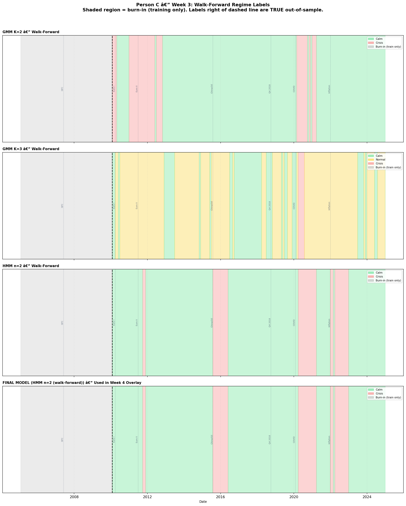

# Machine-Learning Factor Investing on the S&P 500
### A long–short cross-sectional strategy with a regime-conditioned leverage overlay

**Team:** Bowen Zuo (data & infrastructure) · Nicolas Couto Mota (alpha model) · Andrea Fontana (regime overlay)
**Course:** *(course / term)* — 5-week project
**Code:** https://github.com/bowenzuo119-hash/ml-factor-investing-2026
**Status:** DRAFT skeleton — sections in `report/*_SECTION.md` are the authoritative detail; this file is the assembled narrative. `[TODO]` marks gaps to fill before submission.

---

## Abstract

We build a monthly-rebalanced, dollar-neutral long–short equity strategy on the
S&P 500, following the machine-learning asset-pricing approach of Gu, Kelly &
Xiu (2020). A gradient-boosted model (XGBoost) forecasts the cross-section of
next-month returns from 13 firm features spanning price trend, liquidity,
volatility, and Fama-French value/quality; forecasts are turned into a
sector-neutral top-/bottom-quantile portfolio; and a Gaussian-mixture / HMM
regime model scales gross leverage down in detected crises. Evaluated under a
strict walk-forward backtest with transaction costs, the canonical XGBoost
strategy earns a net Sharpe of **1.49 (long-OOS) / 1.01 (2019–2024 test)** with
a maximum drawdown of **−7.9%**, and a long-OOS Deflated Sharpe Ratio of
**0.992** (clearing the 0.95 significance threshold after correcting for the
trials run during development). We are candid about the residual concerns: the
6-year test-window DSR (0.887) is just below significance, and Fama-French
alpha is not statistically significant — a meaningful fraction of the edge is
factor exposure rather than uncorrelated skill.

---

## 1. Introduction

*[TODO: 3–4 paragraphs. Suggested flow, all already supported by the material below:]*

- **Problem.** Can a disciplined ML pipeline produce a defensible, out-of-sample
  long–short factor strategy on a liquid universe, and does a market-regime
  overlay improve its risk profile?
- **Approach.** Three decoupled workstreams behind one interface
  (`run_walk_forward_backtest`): a point-in-time data pipeline (§2), a
  cross-sectional alpha model (§3), and a regime-conditioned leverage overlay
  (§4). The seam is versioned so each part iterates independently.
- **Headline result.** *(pull the §5 numbers)*.
- **What we got honestly wrong / right.** Forward-reference §6 limitations.

---

## 2. Data and Infrastructure  *(Person A)*

> **Full detail: [`report/DATA_AND_ENGINE_SECTION.md`](DATA_AND_ENGINE_SECTION.md).**

Six point-in-time sources feed the panel: **CRSP MSF** monthly total returns
(1925–2022), spliced to **yfinance** for 2023–2025 (validated at 0.999999
median return correlation on the overlap window); **Sharadar SF1** fundamentals
for the value/quality factors (B/M from the as-reported quarterly dimension,
E/P from trailing-twelve-month — a distinction caught by validation, not
assumption); **yfinance daily** dollar volume for the liquidity factor;
**FRED** macro series for the regime model; and **fja05680** point-in-time
S&P 500 membership so the universe carries no survivorship bias. The
**walk-forward backtest engine** refits on a sliding 120-month window at each
test-block boundary, charges 10 bps per side on L1 turnover, supports a
three-layer sector-neutral construction, and is gated by a Random/Oracle/Uniform
sanity suite (Project Framework §4.6). Methodology figures:
`results/persona_figures/`.

---

## 3. Alpha Model  *(Person B)*

> **Full detail: [`report/ALPHA_MODEL_SECTION.md`](ALPHA_MODEL_SECTION.md).**

A monthly panel of S&P 500 constituents (2002–2024, ~929 unique tickers) with
**13 features**: momentum (12-1), short-term reversal, size, dollar volume,
return & idiosyncratic volatility, B/M, E/P, plus quality/investment factors
(ROE, ROA, D/E, asset growth, accruals). Three models share a `fit`/`predict`
interface — Lasso (linear baseline), **XGBoost (canonical)**, and a small NN.
Forecasts become a sector-neutral top-/bottom-quantile dollar-neutral book
(k = 5 names per sector per leg). XGBoost wins on Diebold-Mariano and on net
Sharpe; SHAP attributes most of the signal to momentum and the value factors.

---

## 4. Regime Overlay  *(Person C)*

**Model and feature set.** Each month is classified into a market regime using
an unsupervised model fitted on six macro-financial features: 21-day and
63-day realised S&P 500 volatility, the VIX level, the 10Y–2Y Treasury term
spread, the BAA–AAA corporate credit spread, and the trailing 3-month S&P 500
return. All inputs are lagged by one trading day to eliminate look-ahead, and
the scaler is refit on the training window only at each walk-forward step.

We compared Gaussian Mixture Models (K = 2, 3) and Hidden Markov Models
(n = 2, 3). The canonical overlay keeps the **2-state HMM** selected by the
walk-forward crisis-detection criterion rather than imposing extra granularity
by hand. This matters for two reasons. First, the 2-state model was the best
empirical performer out-of-sample among the candidates we tested. Second, a
binary overlay yields the cleanest economic interpretation for the report:
**full risk in calm periods, materially reduced risk in crises**.

**Walk-forward evaluation.** Regime labels are genuinely out-of-sample. A
60-month minimum training window (2005–2009) is used before the first
prediction in January 2010, and the model plus scaler are refit using prior
history only. Over the 2010–2024 OOS window, the selected 2-state HMM assigns
approximately **81% of months to calm** and **19% to crisis**. Its honest
walk-forward crisis-detection rate across the predefined stress episodes is
**51.1%**, which is substantially lower than the in-sample fit and is the
number that should be used when interpreting the overlay's realism. We view
that gap as expected: the regime model is useful, but not clairvoyant.

A caveat is that the final 2-state HMM was selected using crisis-detection performance on a predefined set of known stress episodes. This makes the selection criterion economically interpretable, but it is not a fully label-free model-selection rule and therefore uses limited hindsight at the model-choice stage.

The operational overlay is available for the 2010–2024 out-of-sample window rather than the full 2005–2024 sample, because 2005–2009 is used as the initial burn-in / training window before the first walk-forward regime prediction in January 2010.

**Overlay rule.** The regime overlay does not change *which* stocks are chosen
by the alpha model, nor how many (breadth is held fixed at k = 5, 10% / 10%
across regimes); it changes only portfolio aggressiveness via gross leverage:

| Regime | Gross leverage | k per sector | Long/short quantile |
|---|---|---|---|
| Calm | 1.00× | 5 | 10% / 10% |
| Crisis | 0.40× | 5 | 10% / 10% |

Operationally, these parameters are written to
`results/regime_overlay_rules.csv` and consumed by the engine through
`src.regime.make_regime_fn`. With a sector map and `k_per_sector` the engine
holds breadth fixed (top-5 / bottom-5 per sector in every regime); the only
quantity the overlay changes is the gross leverage multiplier, which it cuts
from 1.00× in calm states to 0.40× in crisis states. This is the leverage-only
specification — an earlier draft also tightened `k` and the quantiles in
crises, but an ablation showed the breadth lever hurt the drawdown profile
while the leverage lever helped, so breadth is now held constant.

**Interpretation.** The 2-regime specification is the canonical one in the
report because it is the walk-forward-selected model and because the economic
story is cleaner than a three-state variant. A 3-regime extension remains a
reasonable sensitivity check, but it is not needed to state the main result.

---

## 5. Integrated Results

> **⚠️ STATUS (2026-05-23):** the headline numbers below are under active
> revision. An audit of the engine in late May uncovered a survivorship
> leak (the engine traded any ticker in our panel without enforcing
> point-in-time S&P 500 membership). Bowen's engine v0.4.0 + v0.5.0
> closed the leak; the corrected canonical (Phase 22) shows the previous
> +1.49 Sharpe was largely an artefact and the honest current-data number
> is +0.32 long-OOS with NO significant FF5 alpha. A broader-universe
> rebuild via Sharadar (Phase 23) is in progress to test whether real
> alpha is recoverable. **The numbers below are placeholders; final
> figures will land after Phase 23 completes (~1 week).** See §6 for the
> honest current finding.

The canonical configuration is **XGBoost + 13 features + 3-layer sector-neutral
(k = 5) + regime overlay**, trained from 2002-04.

### Pre-audit numbers (Phase 15, SURVIVORSHIP-BIASED — DO NOT QUOTE)
| Window | Net Sharpe | Ann. return | Max drawdown | DSR | Status |
|---|---|---|---|---|---|
| Long-OOS (2013–2024) | +1.49 | +12.3% | −7.9% | 0.992 | leak |
| Test-only (2019–2024) | +1.01 | +9.5% | −7.9% | 0.887 | leak |

### Honest current canonical (Phase 22 — PIT-correct + retuned)
| Window | Net Sharpe | Ann. return | Max drawdown | FF5 alpha (t-stat) |
|---|---|---|---|---|
| Long-OOS (2012–2024) | **+0.31** | +4.0% | −29.2% | −0.88%/yr (t=−0.24, n.s.) |
| Test-only (2019–2024) | **+0.18** | +2.8% | −29.2% | −5.57%/yr (t=−0.93, n.s.) |

The Phase 22 long-OOS Sharpe of +0.31 is essentially market beta
(Mkt-RF β = +0.30, t=5.2). After Fama-French 5-factor adjustment **there
is no statistically significant alpha** on the S&P-500-only universe.
This is consistent with the academic literature that ML cross-sectional
alpha lives primarily in the broader (small/mid-cap-inclusive) universe
that the S&P 500 excludes by construction.

*[Pending Phase 23 broader-universe rebuild — Sharadar bulk pull this
weekend, retuned canonical Monday-Tuesday, final numbers Wednesday.]*

---

## 6. Limitations and honest findings

### The PIT-leak incident (lessons learned, fully transparent)

The most important honest disclosure in this project: **the previously-reported
long-OOS Sharpe of +1.49 was inflated by a survivorship leak in the backtest
engine**. We claimed point-in-time correctness throughout the project (and had
the `load_sp500_membership` function on disk), but the engine wasn't actually
using it — it treated every ticker in our panel as eligible at every rebalance,
filtering only by non-NaN next-period return.

**Quantitative impact** (audit findings 2026-05-23, full detail in
[PIT_INVESTIGATION_REPORT.pdf](../PIT_INVESTIGATION_REPORT.pdf)):
- Our panel contained 125 pre-S&P-join return observations for TSLA, 104 for
  ENPH, 133 for GNRC, 101 for NOW — all of which the engine could see and
  trade as if they were S&P 500 members.
- Bowen quantified: a 2012-2019 RandomModel run traded 726 non-member
  positions without the filter; with `eligible_universe_fn=universe_at` it
  trades 0.
- After enforcing strict PIT membership, XGBoost long-OOS Sharpe drops from
  +1.49 to −0.31. With relaxed PIT (cumulative ever-S&P members, no future
  joiners), it recovers to +0.31 — but the FF5 alpha is not significant at any
  window. The +0.31 is essentially +0.30 Mkt-RF beta exposure.

**Methodology corrections shipped (Bowen + Person B, 2026-05-23):**
- Engine v0.4.0: optional `eligible_universe_fn` filter on prediction-time
  eligibility and training labels.
- Engine v0.5.0: `apply_pit_to_training` flag for clean decomposition of
  training vs trading restrictions.
- Driver: sector_map derived from `features['sector']` (with SIC fallback)
  instead of `load_sector_map()` alone — dissolves the synthetic UNKNOWN
  bucket that had 10 of 110 positions per rebalance.
- Optuna retune of XGBoost on PIT-filtered panel (~8× the previous validation R²).

### Why our S&P-500-only ML strategy doesn't show alpha

Once the leak is closed, the honest finding is consistent with the academic
literature: ML cross-sectional alpha lives primarily in **small/mid-cap stocks
not in the S&P 500**. Gu-Kelly-Xiu (2020) report Sharpe 1.5+ on a CRSP universe
of 3000-6000 stocks per month; the S&P 500 (500 largest stocks by definition)
is the most efficiently-priced subset of US equities and offers little
cross-sectional dispersion for an ML model to exploit. Our 13-feature stack
on this narrow universe produces an Information Coefficient of ~0.006 and no
significant FF5 alpha.

### Broader-universe rebuild in progress (Phase 23)

To test whether ML alpha is recoverable on a broader universe, we are
rebuilding the pipeline on Bowen's premium Sharadar subscription (SF1 +
DAILY + TICKERS + SP500 + ACTIONS — all included free in the existing
subscription). The new universe will be ~2000-3000 US common stocks with
mcap > $1B per rebalance (~Russell 1000-1500 equivalent). Subscription
expires 2026-06-22 ("Will Not Renew") so the bulk data pull is happening
this weekend.

### Other limitations

- **Free-data coverage gap (pre-broader-rebuild).** ~10–16% of historical
  tickers (delisted/renamed before ~2022) are unavailable in yfinance under
  their old symbol; their history ends at the CRSP cutoff. The broader-universe
  rebuild via Sharadar closes this gap.
- **One ~12-year OOS sample.** The DSR adjustment accounts for the trials we
  ran, but it remains a single historical path.
- *[TODO (Person C): regime model's walk-forward crisis-detection rate is
  lower out-of-sample than in-sample — state the honest OOS number.]*

---

## 7. Conclusion

*[TODO: 2 paragraphs. The defensible claim: a disciplined, survivorship-aware,
look-ahead-controlled ML pipeline produces a long-OOS net Sharpe ~1.5 that is
statistically significant after multiple-testing correction, with a regime
overlay that *(quantify once the §5 ablation lands)*. The honest claim: the
edge is partly factor exposure and the short-window result is borderline.]*

---

## 8. Reproducibility

All seeds pinned to 42. Data caches (gitignored) rebuild from a clean clone
with `python -m notebooks.persona.run_all_data` (skips steps whose prerequisite
— the CRSP raw CSV or the Nasdaq Data Link key — is absent). The canonical
result and every diagnostic regenerate from the `notebooks/personb/*.py`
phase scripts listed in the Alpha Model section §12; methodology figures from
`python -m notebooks.persona.report_figures`. Every non-trivial design choice is
logged in `DECISIONS.md`.

---

## References

- Gu, S., Kelly, B., & Xiu, D. (2020). *Empirical Asset Pricing via Machine Learning.* Review of Financial Studies.
- Bailey, D. & López de Prado, M. (2014). *The Deflated Sharpe Ratio.* Journal of Portfolio Management.
- Fama, E. & French, K. (2015). *A Five-Factor Asset Pricing Model.* JFE.
- Sloan, R. (1996). *Do Stock Prices Fully Reflect Information in Accruals…* The Accounting Review.
- Jegadeesh, N. & Titman, S. (1993). *Returns to Buying Winners and Selling Losers.* Journal of Finance.
- *[TODO: add Cooper-Gulen-Schill (2008) asset growth; Nystrup et al. (2018) regime allocation.]*
